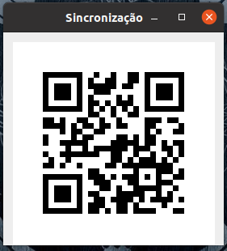
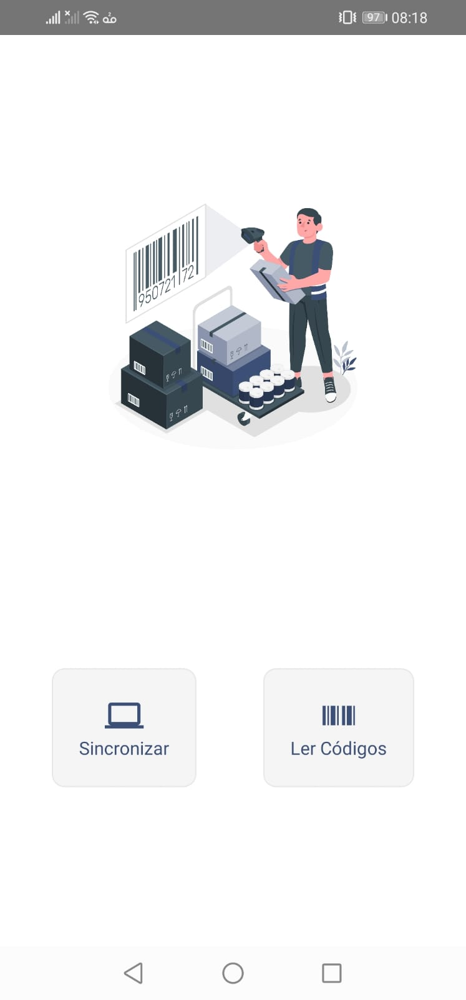
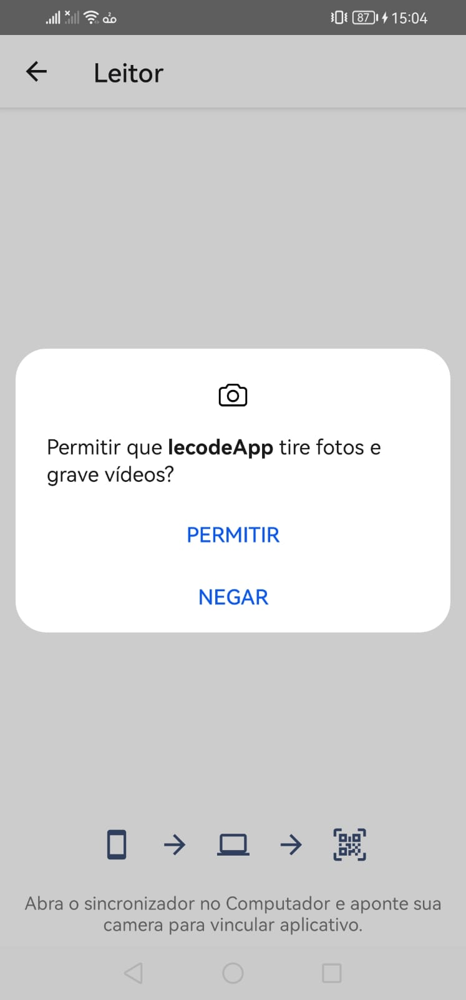
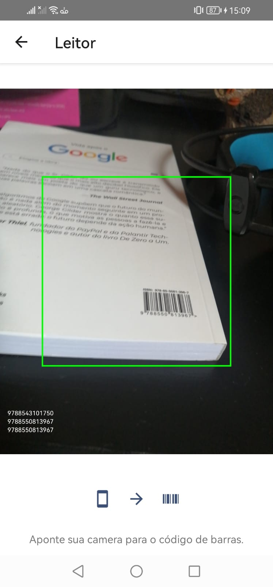
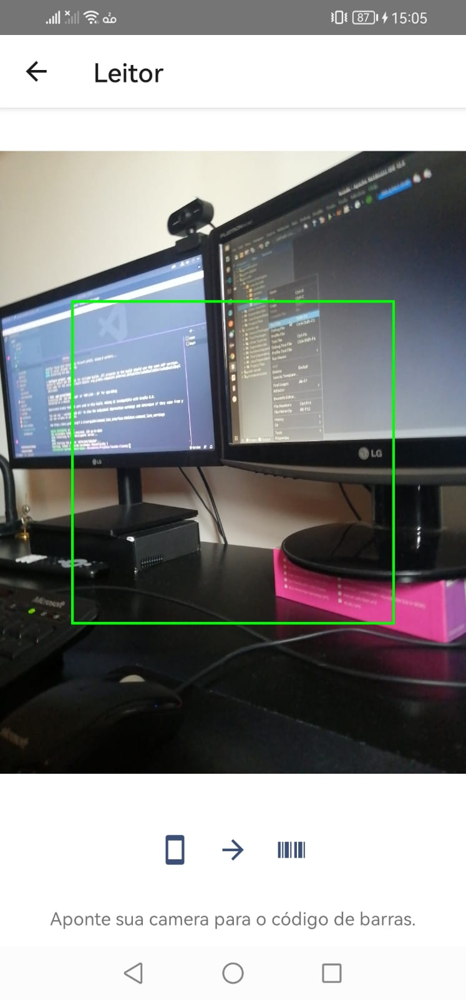
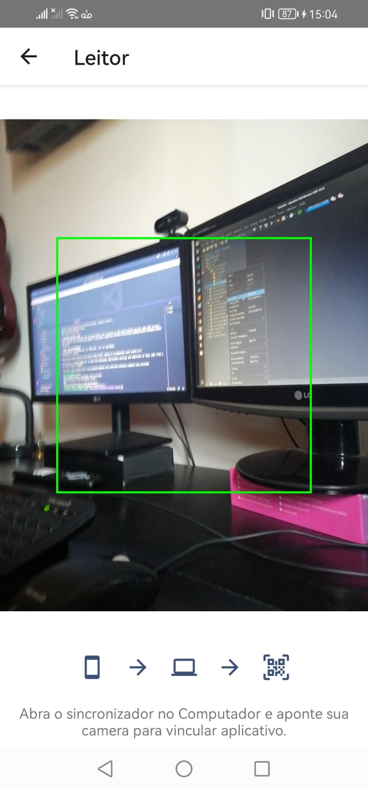

# Lecode

O projeto consiste em um aplicativo que substitui a funcionalidade de um leitor de código de barras convencional. Basta executar o arquivo JAR em seu computador que o mesmo iniciara um serviço local e gerara um QR Code com o endereço do mesmo. Pelo aplicativo você conseguira sincronizar a comunicação com seu computador com uma simples leitura do QR Code gerado em sua tela. Após isso basta ler os códigos de barras que o mesmo será gerado automaticamente onde o cursor do mouse estiver focado. (A comunicação é feita via requisições HTTP).

## Layout da Aplicação

 
  
  

  

  
  
  
   
    
  

<h2>🛠 Tecnologias Utilizadas</h2>

   
     
    
   
 

